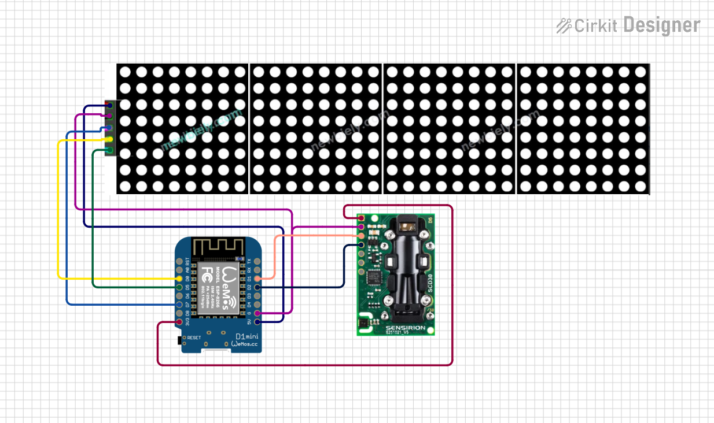

# ESP8266 SCD30 MAX7219

Project based on **Wemos D1 mini (ESP8266)** for measuring **CO₂ / temperature / humidity** from the **SCD30** sensor and displaying values on a **MAX7219 8x32 LED matrix**.

## What this project does

- Reads data from `SCD30` (CO₂, temperature, humidity).
- Shows values on `MAX7219 8x32`.
- Works over Wi-Fi and supports web interface/OTA (implemented in the project code).

## Components

- `Wemos D1 mini (ESP8266)`
- `SCD30` (CO₂ + Temperature + Humidity)
- `MAX7219 8x32 LED Matrix`

## Wiring

### MAX7219 8x32 → Wemos D1 mini

- `Vcc` → `5V`
- `Gnd` → `G`
- `Din` → `D7`
- `CS` → `D0`
- `CLK` → `D5`

### SCD30 → Wemos D1 mini

- `Vin` → `3V3`
- `GND` → `G`
- `SCL` → `D1`
- `SDA` → `D2`

## Schematic (visual)

## Schematic files

Schematic files:

- `data/circuit_image.svg`
- `data/ESP8266_SCD30_MAX7219.ckt`

## Note

The original wiring and component description is based on `data/doc.md`.
